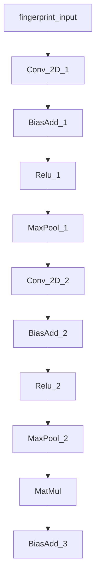

# 语音识别学习笔记

TensorFlow官方提供的语音识别案例，使用的是CNN方式进行识别。CNN一般用于图片的识别，因此使用CNN进行语音识别就必须将声音波形转化为图像，通过对波形图像的识别来达到语音识别的目的。

本周主要学习了CNN的基础知识以及TensorFlow语音识别案例提供的官方论文《Convolutional Neural Networks for Small-footprint Keyword Spotting》

## CNN基础

### CNN构成

卷积神经网络与神经网络的区别在于<u>增加了若干个卷积层</u>，卷积层可以细分为**卷积**（CONV）和**池化**（POOL）两部分操作。然后是全连接层（FC），可与神经网络隐藏层相对应，最后是softmax层输出预测值y_hat。


### 向前传播过程

包括：**填充**（Padding），**卷积操作**（Conv），**激活函数**（ReLu），**池化**（Pooling），**全连接**（FC），**Softmax分类**。

#### 填充（Padding）

对输入图像进行卷积时，角落与边缘的像素点使用次数较少，图像识别弱化边缘信息。因此在图像的原始数据周围填充p层数据。当填充数据为0时，称为**Zero-padding**。除保留更多信息外，Padding还可保证使用卷积后高和宽不变化。

代码实现：

~~~python
#使用函数np.pad().
a = np.pad(a, ((0,0),(1,1),(0,0)),'constant')
#np.pad(待padding数组，((前面padding的行数，后面padding的行数)，...)，padding的方式)
~~~

#### 单步卷积

过滤器：通道数与图像相同，长宽比原图小，一般是奇数（1,3,5,7，...）的多维数组（**f**，f，n_c)

步长：每次移动的像素数（**s**）

#### 卷积层

CNN卷积层有多个过滤器，输出时将每个过滤器卷积后的图像叠加在一起输出。

输出维度公式：
$$
n_H=[\frac{n_Hprev-f+2 \times pad}{s}]+1
$$

$$
n_W=[\frac{n_Wprev-f+2 \times pad}{s}]+1
$$

$$
n_c=卷积中的频道数（Channel）
$$

#### 池化层（Pooling Layer）

缩减网格大小，提高运算速度，包括**最大池化**（Max-pooling）和**平均池化**（Average-pooling）。

参数：窗口大小（f）和步长（s）

池化后矩阵维度公式：
$$
n_H=[\frac{n_Hprev-f}{s}]+1
$$

$$
n_W=[\frac{n_Wprev-f}{s}]+1
$$

$$
n_C=n_Cprev
$$

### 反向传播过程（编写程序时程序自动实现）

#### 卷积层反向传播

##### 计算dA

设过滤器参数矩阵为W_C,
$$
dA+=\sum^{n_H}_{h=0}\sum^{n_W}_{W=0}W_c\times dZ_{hw}
$$


其中dZ_nW是卷积层输出第Z行w列的梯度下降值，在更新时dA每次用不同的dZ与W_C相乘。

##### 计算dW

$$
dW+=\sum^{n_H}_{h=0}\sum^{n_W}_{W=0}a_{slice}\times dZ_{hw}
$$

其中a_slice是从a_prev中截取的计算矩阵。

##### 计算db

$$
db=\sum_{h}\sum_{w}dZ_{hw}
$$

#### 池化层的反向传播

##### max-pooling的反向传播

创建辅助函数creat_mask_from-windows()，作用是使window矩阵中最大元素标志为1，其余为0.
$$
X=[\matrix{1 & 3\\ 4 & 2}]\rightarrow W=[\matrix{0&0\\1&0}]
$$

~~~python
mask = (x == np.max(x))
~~~

##### average-pooling反向传播

输入元素同等重要，给予各元素相同权重。

$$
dZ=1\rightarrow dZ=[\matrix{1/1&1/4\\1/4&1/4}]
$$

## 论文阅读

### 采用CNN的原因

1. 语音的波谱在时间和频率上具有相关性，使用CNN可以通过输入空间的局部区域共享的权重来模拟；

2. CNN通过平均隐藏单元在不同的局部时间和频率区域的输出来捕获参数较少的平移不变性。减少由于口音和发声方式带来的差异。

### CNN架构

给出输入信号$ V\subset R^{t\times f}$，其中$t$和$f$是时间和频率输入的维度。与一个权矩阵$W\subset R^{(m\times r)\times n}$与$V$进行全卷积。大小为$m\times r$，权重矩阵有n个隐藏单位，在频率上以p的速度跨步。最终生成n个图，维度为
$$
 \frac{t-m+1}{s}\times \frac{f-r+1}{v}
$$
卷积之后，最大池层有助于消除由于说话风格、信道失真等原因而存在的时频空间中的可变性。池大小为$p\times q$。

最终得到的时频空间维度公式为
$$
\frac{t-m+1}{s\cdot p}\times \frac{f-r+1}{v\cdot q}
$$


#### 经典CNN架构

第一层滤波器大小r=9，该体系结构对时间上的过滤器大小不太敏感，但通常的做法是选择时间上的过滤器大小，该大小跨越时间上总输入大小的2/3，即m=20。卷积乘法是通过在时间和频率上对滤波器进行s=1和v=1的跨越来实现的。接下来，只执行频率不重叠的最大池，池区域为q=3。第二个卷积滤波器的频率大小为r=4，不执行最大池。

一个典型的CNN架构如下表：

该架构称为**CNN-trad-fpool3**。该体系结构具有2个卷积层、1个线性低秩层和1个DNN层。

| type    | m    | r    | n    | p    | q    | Par.   | Mul.      |
| ------- | ---- | ---- | ---- | ---- | ---- | ------ | --------- |
| conv    | 20   | 8    | 64   | 1    | 3    | 10.2K  | **4.4M ** |
| conv    | 10   | 4    | 64   | 1    | 1    | 164.8K | **5.2M**  |
| lin     | -    | -    | 32   | -    | -    | 65.5K  | 65.5K     |
| dnn     | -    | -    | 128  | -    | -    | 4.1K   | 4.1K      |
| softmax | -    | -    | 4    | -    | -    | 0.5K   | 0.5K      |
| Total   | -    | -    | -    | -    | -    | 244.2K | 9.7M      |

这种体系结构的一个主要问题是卷积层中的大量乘法。

#### 限制乘法CNN架构

一个解决方案是有一个卷积层而不是两个。该卷积层的输出然后传递到线性低阶层，然后传递到2个DNN层。我们称为**CNN-One-FPool3**，构造如下表：

| type    | m    | r    | n    | p    | q    | Params | Mult   |
| ------- | ---- | ---- | ---- | ---- | ---- | ------ | ------ |
| conv    | 32   | 8    | 54   | 1    | 3    | 13.8K  | 456.2K |
| linear  | -    | -    | 32   | -    | -    | 19.8K  | 19.8K  |
| dnn     | -    | -    | 128  | -    | -    | 4.1K   | 4.1K   |
| dnn     | -    | -    | 128  | -    | -    | 16.4K  | 16.4K  |
| softmax | -    | -    | 4    | -    | -    | 0.5K   | 0.5K   |
| Total   | -    | -    | 4    | -    | -    | 53.8K  | 495.6K |

下表显示了当我们有一个r=8的频率滤波器，并以v=4（即50%的重叠）跨步滤波器，以及当我们以v=8跨步滤波器（无重叠）时的CNN架构。我们将分别称为**cnn-one-fstride4**和**cnn-one-fstride8**。

| model | m    | r    | n    | s    | v    | Params | Mult   |
| ----- | ---- | ---- | ---- | ---- | ---- | ------ | ------ |
| (a)   | 32   | 8    | 186  | 1    | 4    | 47.6K  | 428.5K |
| (b)   | 32   | 8    | 336  | 1    | 8    | 86.6K  | 430.1K |

   如果我们将过滤器跨过v>1，我们会减少乘的次数，因此可以将隐藏单元n的数量增加到比cnn-one-fpool3架构大3-4倍。

#### 限制参数CNN架构

提高CNN性能的方法是增加功能图。如果我们想增加特征图，但保持参数不变，我们必须探索采样的时间和频率。我们已经在cnn-trad-fpool3中讨论了频率，我们将及时探索子采样。探索是否可以通过跨越或汇集的方式，及时对信号进行次采样，从而改善cnn-trad-fpool3。

我们将卷积中的时间滤波器跨过一定数量s>1的架构进行比较。

| model        | layer | m    | r    | n    | s    | q    | Params |
| ------------ | ----- | ---- | ---- | ---- | ---- | ---- | ------ |
| cnn-tstride2 | conv  | 16   | 8    | 78   | 2    | 3    | 10.0K  |
|              | conv  | 9    | 4    | 78   | 1    | 1    | 219.0K |
|              | lin   | -    | -    | 32   | -    | -    | 20.0K  |
| cnn-tstride4 | conv  | 16   | 8    | 100  | 4    | 3    | 12.8K  |
|              | conv  | 5    | 4    | 78   | 1    | 1    | 200.0K |
|              | lin   | -    | -    | 32   | -    | -    | 25.6K  |
| cnn-tstride8 | conv  | 16   | 8    | 126  | 8    | 3    | 16.1K  |
|              | conv  | 5    | 4    | 78   | 1    | 1    | 190.5K |
|              | lin   | -    | -    | 32   | -    | -    | 32.2K  |

所有实验中某些变量保持不变，即频率步幅v=1和时间池p=1。随着时间过滤器步幅的增加，我们可以增加特征映射n的数量，从而使参数总数保持不变。

#### 及时池化

我们在时间p中改变池的配置。我们将这些架构称为cnn-tpool2和cnn-tpool4。通过时间池，我们可以增加功能图n的数量，以保持参数总数不变。

| model      | layer | m    | r    | n    | p    | q    | Params |
| ---------- | ----- | ---- | ---- | ---- | ---- | ---- | ------ |
| cnn-tpool2 | conv  | 21   | 8    | 94   | 2    | 3    | 5.6M   |
|            | conv  | 6    | 4    | 94   | 1    | 1    | 1.8M   |
|            | lin   | -    | -    | 32   | -    | -    | 65.5K  |
| cnn-tpool3 | conv  | 15   | 8    | 94   | 3    | 3    | 7.1M   |
|            | conv  | 6    | 4    | 94   | 1    | 1    | 1.6M   |
|            | lin   | -    | -    | 32   | -    | -    | 65.5K  |


# Speech_command程序分析

本程序参考了TensorFlow中Examples中的Speech_command案例，但是做出了一些更改，主要的程序架构如下：

## 数据处理

### 数据的读取及存放

* 首先使用gfile.Glob(search_path)函数，利用正则表达式，搜索\code\inputdata下属文件夹中的所有音频文件路径，并返回List。

* 使用for循环获取路径文件名，并且获取每个音频文件的唯一编码。（可以看出‘_nohash_’字符串之前为每个音频的唯一编码）

* 利用hash编码，并利用公式计算出一个0-1范围内的值（example中为0-100的值，为了有percentage的感觉我换成了0-1），并将验证集设为0.1，测试集设为0.1，最后当算出的数字小于0.1放到验证集，0.1-0.2放入测试集，大于0.2放在训练集，以1:1:8进行分割。

* 将分割好的集合进行随机乱序


### 模型设置

在模型设置里面主要是计算了一些要用的参数，对于声音的处理，有些地方我还是不太了解，所以只能对这些参数做我个人理解，有问题的地方将在括号中写出，默认使用mfcc的方式。

**desired_samples**：每秒采样数*声音长度（毫秒）/1000 = 声音采样数

**window_size_samples**：每秒采样数*频率分析窗口长度（毫秒）/1000 = 窗口分析采样数（**？：窗口的概念以及使用**）

**window_stride_samples**：每秒采样数*窗口移动的秒数（毫秒）/1000 = 窗口移动长度

**spectrogram_length**：产生光谱图个数

**fingerprint_size**：频率宽度\*光谱图个数（**？：这个参数的意义**）


返回值是一个List，List中的参数如下：

```python
		'desired_samples': desired_samples,
        'window_size_samples': window_size_samples,
        'window_stride_samples': window_stride_samples,
        'spectrogram_length': spectrogram_length,
        'fingerprint_width': fingerprint_width,
        'fingerprint_size': fingerprint_size,
        'label_count': label_count,
        'sample_rate': sample_rate,
        'average_window_width': average_window_width
```

### 声音处理

为了使的我们能对声音进行编辑，我们读入声音后进行解码（本次我为了考虑方便去掉了**BACKGROUND**，仅仅对声音本身进行处理，不再进行和背景声音的混合，默认前景声音量最大，为1。

将解码的声音扩大2*2大小，用0填充，并且进行切割，使得切割出来的信号个数为**desired_samples**数量。

### 创建模型

我们阅读的所给的相关文献，文献一共提供了5个模型，example中一共提供了5个模型，我们使用的是叫做**conv**的模型，应该是一个比较经典的模型，模型图示如下：



每一层具体情况如下：

**Conv_1**：fliter大小为8\*20\*64(**?**:为什么不用奇数大小的fliter)，移动步长为1*1

**Maxpool1**:大小为2\*2，步长为2\*2

**Conv_2**：fliter大小为4\*10\*64，移动步长为1*1

最后将得到的矩阵reshape成一行，接下来和weight矩阵（元素个数*label数）相乘，最终的到一个向量，这个向量的维度为label个数，可以直接得到我们的结果（只识别0-9，因此直接把相应的元素位数和这些数字一一对应）

训练过程中还要计算交叉焓，并且训练过程中以交叉焓变小的方向进行训练

训练过程中的一些参数：

**训练步数**：15000+3000=18000（我训练用1800步稍微快一点）

**学习率**：前15000步为0.001，后300步为0.0001    **原因**：后期学习率过大将导致无法拟合，因此需要将学习率减小，保证拟合足够平稳

**训练的具体过程如下：**

1. 每一步从‘training’选择100个（随机选择），进行训练，计算准确率和交叉焓，并且打印INFO；
2. 参数更新，向交叉焓减小的方向更新；
3. 继续重复过程1
4. 如果达到100步的整数倍，计算一次混淆矩阵，分析目前的模型，方法是从‘validation’集合中，进行validation集合个数/100次的训练次数，每次训练100个（按顺序挑选），最后计算混淆矩阵，并加在一起，并且计算总的准确率
5. 最后18000（本次使用1800）步，使用‘test’集合中的数据，训练次数为test集合元素个数/100，每次训练100个，顺序挑选，计算混淆矩阵和总的准确率

## 训练结果

仅仅训练了1800次，准确率在73.1%还是比较好的。（全部的结果在result.txt之中）

## 心得与难点

1. tensorflow自带的speech_command程序，本质上是一个图像识别程序，因此实际上这个程序相对而言是比较简单的，主要难点在于如何生成图像。
2. 本次我着重关注的是CNN网络，对于声波图片的产生了解的比较粗放，并且对于一些关键词理解的不是很透彻，例如：**窗口（Windows）**，**前景声（foreground）**，**time_shifting（说实话没有搞明白这个是一个什么）**等等名词，感觉这些才是重点。
3. 不理解为什么它的CNN里面的fliter使用偶数\*偶数的矩阵（网上查的资料一般都是奇数多一点）
4. 比较遗憾，没有学会怎么调用这个模型进行语音识别（只会进行训练，不知道训练好的模型怎么再用）
5. 对于模型的保存也有点不是很了解（需要之后的学习）
6. 整个程序做的相对来说比较的粗放，我删除了**BACKGOUND**和**SLICENCE**两个部分，直接进行训练
7. 没有好好使用python特性，程序是面向过程的，不是面向对象的，程序结构需要再优化。


